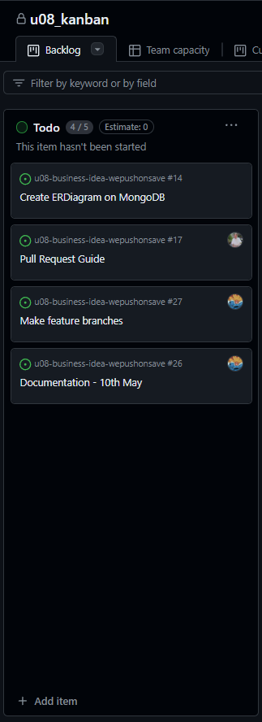
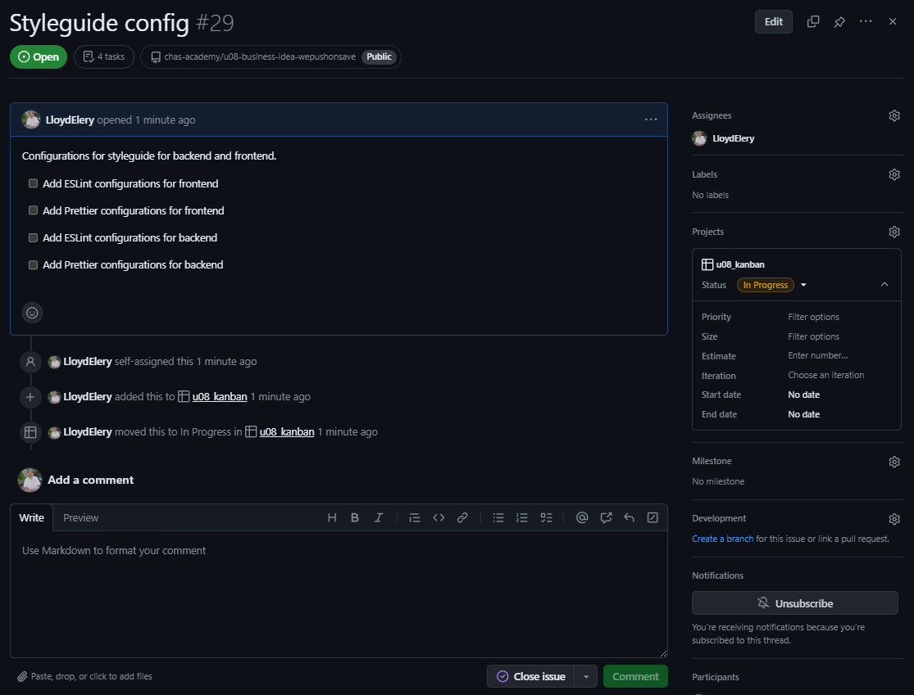
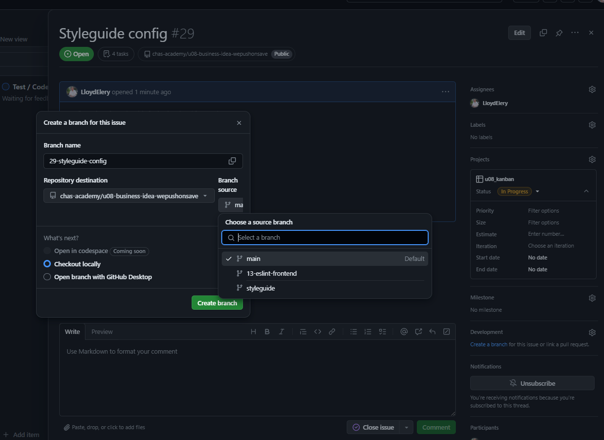
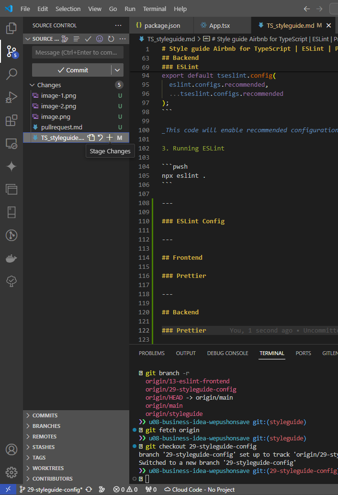

# Issue handeling

1. Add new issue
   
2. Use a explanitory name and a clear guideline to help you complete the issue
   
3. Create a branch by clicking the `create a branch` under **Development** on the right hand side of your newly created issue.
4. Keep the name given to you and select the apropriate 'feature-branch'
   
5. Click create a branch button

# Stay up to date

1. From the **Feature-branch**, run the following command to pull the latest changes from **Main** to the **Feature-Branch**

```pwsh
git fetch origin main:main
git pull origin main:main
```

2. Create the local branch for your issue

```pwsh
git fetch origin
git checkout 00-issue-name
```

3. Make sure you have the latest **Feature-branch** updates

```pwsh
git fetch origin feature-branch:feature-branch
git pull origin feature-branch:feature-branch
```

3. Add a folder, file or comment to activate the remote branch \*i perfer to use "Source Control"
   
